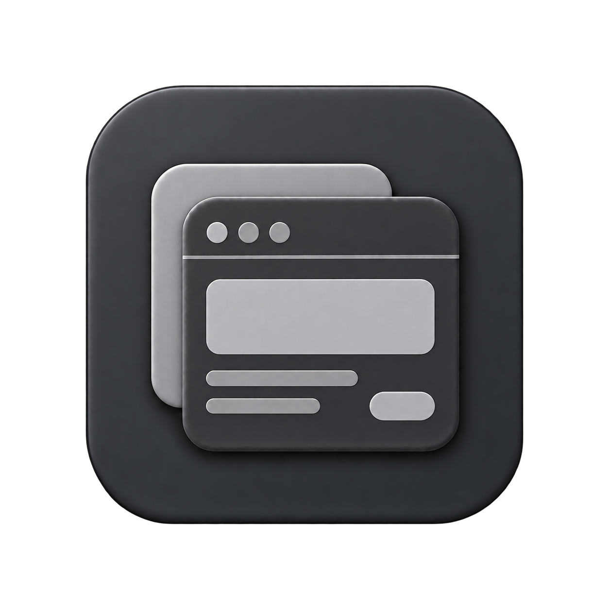

<picture>
  <source media="(prefers-color-scheme: dark)" srcset="assets/cover-dark.svg">
  
</picture>



# MU LABS Poise · UI Design

**Considered interfaces. Responsive interactions.**

[中文](README.md) · [Usage](docs/usage.md) · [Skill](SKILL.md) · [MU LABS](https://mustundead.com/#work)

A personal agent skill by [Mustundead](https://github.com/Mustundead), built around MU LABS product practice. The instructions are written in Chinese and work with the requested Chinese and English interface content.

Use it to design, review, or implement hierarchy, typography, controls, gestures, interruptible motion, materials, and accessibility. It preserves the existing native or web stack and verifies the actual requested surface.

## Install and invoke

Download the [v1.0.2 release](https://github.com/Mustundead/mu-poise-ui-design/releases/tag/v1.0.2) or clone this repository. Place its complete folder in the skill directory configured for your assistant. The MU LABS local Codex workflow uses `~/.codex/skills/mu-poise-ui-design`; use your host’s documented discovery path elsewhere. Do not overwrite an existing installation without comparing or backing it up.

Invoke `$mu-poise-ui-design` in a new session with the target, available evidence, and requested scope. Read [usage](docs/usage.md) for review versus implementation, updates, and limitations. No account, API key, runtime dependency, or background service is included in this package.

## Start with one task

**Review a page.**

```text
Use $mu-poise-ui-design. Review hierarchy, spacing, alignment, and control states on this page against its existing design. Explain issues and recommendations without editing code.
```

**Make the change.**

```text
Use $mu-poise-ui-design. Fix spacing and alignment on this page. Preserve hit areas and interaction behavior, then verify the running page.
```

Include the page, screenshot, or project location. A review delivers findings and recommendations; implementation delivers changes and verification results.

## License and sources

The newly written instructions, documentation, and examples are [MIT licensed](LICENSE). Linked third-party materials retain their own terms. See [sources](references/sources.md) for attribution and adaptation boundaries. These are independent MU LABS methods, not an official Apple or OpenAI product.
