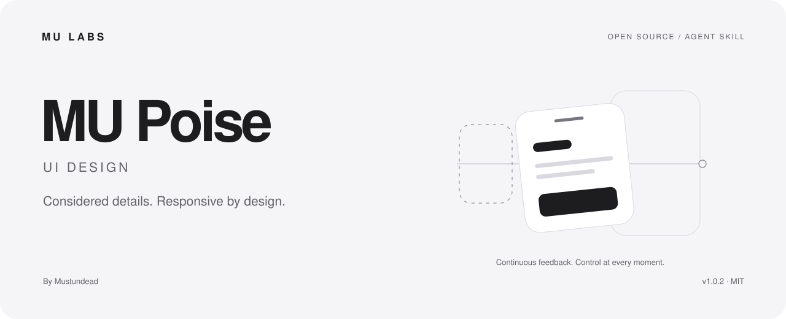

<picture>
  <source media="(prefers-color-scheme: dark)" srcset="assets/cover-dark.svg">
  
</picture>

# MU Poise · UI 设计

**界面设计与交互 · 细节有分寸，操作有回应。**

[下载 v1.0.2](https://github.com/Mustundead/mu-poise-ui-design/releases/tag/v1.0.2) · [English](README.en.md) · [使用文档](docs/usage.md) · [完整技能](SKILL.md) · [MU LABS](https://mustundead.com/#work)

由 [Mustundead](https://github.com/Mustundead) 编写的个人 Agent Skill，把 MU LABS 的产品判断整理成可反复使用的工作方法。支持以 `SKILL.md` 为入口的助手工作流；技能指令以中文编写，可以处理约定范围内的中英文产品内容。

## 为什么叫 MU Poise

Poise 是平衡与从容。它代表布局的分寸、操作的可控，以及动效在恰当时刻给出的回应。 MU 是 MU LABS 的共同署名，功能由副标题说明。

## 它能做什么

布局层级、排版与对齐、控件一致性、拖拽与弹层、可中断动效、材质和无障碍。

提供改写/局部修正、评审、实现与审计等按需路径。保留原有产品、框架和用户授权；简单问题直接处理，重要行为用实际证据确认。

它不规定所有界面都做成玻璃风格，也不把演示、构建或安装当作真实界面验收。

## 细节，要回到使用里判断

| 看见的情况 | MU Poise 关注的判断 |
| --- | --- |
| 图标与文字没对齐 | 是父级间距、字形基线，还是透明边缘 |
| 动画中途重新拖动会跳 | 是否从当前显示位置接管，而非旧目标 |
| 抽屉和列表抢手势 | 是否正确区分拖动、滚动和取消 |
| 模糊叠得很重 | 层级是否需要材质，文字是否仍可读 |
| 构建成功但没打开目标页 | 哪些行为已经验证，哪些还缺运行证据 |

**例如：只缩小菜单栏图标与数字之间的间距。**

修改负责间距的布局，保留按钮的操作范围。再检查实际图标边缘、读数、字号与运行结果。小修正保持小范围，证据跟着改变走。更多情境见 [MU LABS 示例与验收](references/examples-and-acceptance.md)。

## 开始使用

1. 下载 [v1.0.2](https://github.com/Mustundead/mu-poise-ui-design/releases/tag/v1.0.2) 或克隆本仓库。
2. 将包含 `SKILL.md`、`references/`、`agents/` 和 `assets/` 的 `mu-poise-ui-design` 文件夹放进助手已配置的技能目录。MU LABS 的本地 Codex 工作流使用 `~/.codex/skills/`；其他环境按其技能发现设置选择目录。
3. 在新的会话中调用 `$mu-poise-ui-design`，并说明目标、材料和工作范围。

已有同名目录时先比较或备份，不直接覆盖。详见[安装、更新与移除](docs/usage.md)。

```text
使用 $mu-poise-ui-design。调整这个弹层的拖动交互，让它能在回弹途中被重新抓取；保留列表滚动和键盘关闭，验证减少动态效果。
```

## 内容结构

- [SKILL.md](SKILL.md)：触发范围、决策方法、实施与验收。
- [references/](references/)：按任务加载的细节和 MU LABS 教学示例。
- [agents/openai.yaml](agents/openai.yaml)：助手界面元数据与示例调用。
- [使用文档](docs/usage.md)：安装、调用、工作模式和证据边界。
- [评估情境](docs/evaluation.md)：维护时用于检查行为的题目。
- [资料与取舍](references/sources.md)：来源、采用的原则及适用边界。

## 许可与贡献

本仓库新写的技能、文档和示例以 [MIT](LICENSE) 开源，可使用、修改和再分发，需保留许可证声明。链接的外部资料仍遵循各自条款。产品和平台名称用于说明语境，不表示官方关联或背书。

问题或改进建议请附具体场景、实际行为和期望结果；见[贡献说明](CONTRIBUTING.md)。与另一项 [MU Phrase](https://github.com/Mustundead/mu-phrase-ui-copy) 可共同使用，但共享的检查只做一次。
